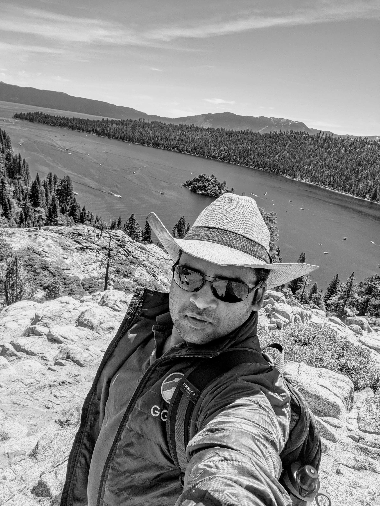

# Charith Wickramaarachchi

I am a staff software engineer at Google. I currently work in the traffic management problem space in the Google Wide Area Network. My research interests include distributed systems, parallel and distributed computing, and networking.

Prior to joining Google in 2017, I received my Ph.D. in Computer Science from the University of Southern California. Before that, I received my B.Sc. Engineering degree from University of Moratuwa, Sri Lanka.

[LinkedIn](https://www.linkedin.com/in/charith-wickramaarachchi-43797218/) | [Google Scholar](https://scholar.google.com/citations?user=R84Xky0AAAAJ&hl=en)

